# 01 - High-Level Architecture Map

This document visualizes the entire system architecture of the Gym App across presentation, state, logic, persistence, and hardware integration.

---

## System Architecture Diagram

```mermaid
flowchart TB
    subgraph PresentationLayer["Presentation Layer (Expo Router v57)"]
        RootLayout["Root Layout<br/>app/_layout.tsx"]
        TabLayout["Tabs Layout & Tab Bar<br/>app/(tabs)/_layout.tsx"]
        
        ScreenLog["Log Screen<br/>app/(tabs)/index.tsx"]
        ScreenStats["Stats Screen<br/>app/(tabs)/stats.tsx"]
        ScreenTimer["Timer Screen<br/>app/(tabs)/timer.tsx"]
        ScreenConvert["Convert Screen<br/>app/(tabs)/convert.tsx"]
        ScreenSettings["Settings Screen<br/>app/(tabs)/settings.tsx"]
    end

    subgraph ComponentLayer["Component & Modal System"]
        UIPrimitives["UI Primitives (src/components/ui/)<br/>Screen, Text, Button, Stepper, SetRow, Badge, Field, Rule"]
        Modals["Domain Modals (src/components/)<br/>ExerciseModal, ExerciseActionModal, FinishWorkoutModal"]
    end

    subgraph StateLayer["State Management & Ambient Contexts"]
        ThemeCtx["ThemeContext<br/>src/theme/ThemeContext.tsx<br/>(ThemeMode, AccentColor, Palettes)"]
        TimerCtx["TimerContext<br/>src/timer/TimerContext.tsx<br/>(Rest countdown, Chime, KeepAwake)"]
    end

    subgraph LogicLayer["Domain Business Logic (Pure Functions)"]
        SuggestProg["Progressive Overload Logic<br/>src/logic/suggestNext.ts<br/>suggestNext()"]
        Conversions["Math & Unit Conversions<br/>src/logic/conversions.ts<br/>lbToKg(), kgToLb(), calculateE1RM()"]
        PlateMath["Barbell Math<br/>app/(tabs)/convert.tsx<br/>getPlateBreakdown()"]
    end

    subgraph DALayer["Data Access Layer (Repositories & Migrations)"]
        Schema["Schema & Migrations<br/>src/db/schema.ts<br/>migrateDbIfNeeded()"]
        CoreQueries["Core Queries<br/>src/db/queries.ts<br/>startSession(), addSet(), getExercises(), etc."]
        StatsQueries["Analytics Queries<br/>src/db/statsQueries.ts<br/>getStatsForExercise(), getLifetimeStats(), etc."]
        SeedData["Demo Seeder<br/>src/db/seedDemoData.ts<br/>seedDemoData()"]
    end

    subgraph PersistenceLayer["Local Persistence & Native Services"]
        SQLiteDB[("SQLite Database<br/>gym.db (WAL Mode)")]
        DocFS["expo-file-system<br/>(theme/sound prefs, JSON & CSV backups)"]
        Hardware["Native Hardware Services<br/>expo-haptics, expo-audio, expo-keep-awake, expo-sharing"]
    end

    %% Wiring
    RootLayout --> ThemeCtx
    RootLayout --> SQLiteDB
    RootLayout --> TimerCtx
    RootLayout --> TabLayout

    TabLayout --> ScreenLog
    TabLayout --> ScreenStats
    TabLayout --> ScreenTimer
    TabLayout --> ScreenConvert
    ScreenLog -. "Push route" .-> ScreenSettings

    ScreenLog --> UIPrimitives
    ScreenLog --> Modals
    ScreenStats --> UIPrimitives
    ScreenTimer --> UIPrimitives
    ScreenConvert --> UIPrimitives
    ScreenSettings --> UIPrimitives

    ScreenLog --> SuggestProg
    ScreenLog --> CoreQueries
    ScreenStats --> StatsQueries
    ScreenStats --> Conversions
    ScreenTimer --> TimerCtx
    ScreenConvert --> Conversions
    ScreenConvert --> PlateMath
    ScreenSettings --> CoreQueries
    ScreenSettings --> DocFS

    CoreQueries --> SQLiteDB
    StatsQueries --> SQLiteDB
    Schema --> SQLiteDB

    TimerCtx --> Hardware
    ScreenLog --> Hardware
    ScreenSettings --> Hardware
    ThemeCtx --> DocFS
```

---

## Architectural Subsystems Breakdown

### 1. Presentation & Routing Layer
- **Root Layout** ([`app/_layout.tsx`](file:///home/leinnarf/Project/Gym%20App/app/_layout.tsx)): Initializes fonts (`IBMPlexMono`, `IBMPlexSans`), bootstraps the SQLite provider with schema migrations, mounts the global theme and timer providers, and renders the stack navigator.
- **Tabs Navigator** ([`app/(tabs)/_layout.tsx`](file:///home/leinnarf/Project/Gym%20App/app/(tabs)/_layout.tsx)): Renders the custom `IndustrialTabBar` with haptic feedback on navigation. Houses four visible tabs (`Log`, `Timer`, `Convert`, `Stats`) and hides `Settings` from the bottom bar.
- **Log Screen** ([`app/(tabs)/index.tsx`](file:///home/leinnarf/Project/Gym%20App/app/(tabs)/index.tsx)): The core operational screen for selecting exercises, configuring weight/reps with steppers, logging sets, and triggering overload prompts.
- **Stats Screen** ([`app/(tabs)/stats.tsx`](file:///home/leinnarf/Project/Gym%20App/app/(tabs)/stats.tsx)): Analytical dashboard providing lifetime aggregates, PR records, Double Progression status, interactive charts, and past session history.
- **Timer Screen** ([`app/(tabs)/timer.tsx`](file:///home/leinnarf/Project/Gym%20App/app/(tabs)/timer.tsx)): Rest timer with quick presets (30s to 10m), custom interval input, a +30s booster, and segmented progress bars.
- **Convert Screen** ([`app/(tabs)/convert.tsx`](file:///home/leinnarf/Project/Gym%20App/app/(tabs)/convert.tsx)): Bi-directional unit converter between pounds and kilograms, including automatic barbell plate loading calculation.
- **Settings Screen** ([`app/(tabs)/settings.tsx`](file:///home/leinnarf/Project/Gym%20App/app/(tabs)/settings.tsx)): Controls theme mode, accent palette, audio alerts, and full database export/restore (JSON and CSV).

### 2. UI Components & Design System
- **UI Primitives** ([`src/components/ui/`](file:///home/leinnarf/Project/Gym%20App/src/components/ui/index.ts)): Reusable, design-token-compliant components:
  - [`Screen`](file:///home/leinnarf/Project/Gym%20App/src/components/ui/Screen.tsx): Standardized screen wrapper with safe-area insets, status bar styling, and customizable headers.
  - [`Button`](file:///home/leinnarf/Project/Gym%20App/src/components/ui/Button.tsx): Primary and secondary tactile buttons with light haptic feedback.
  - [`Stepper`](file:///home/leinnarf/Project/Gym%20App/src/components/ui/Stepper.tsx): Number input with increment/decrement buttons supporting press-and-hold repeating.
  - [`SetRow`](file:///home/leinnarf/Project/Gym%20App/src/components/ui/SetRow.tsx): Tabular row for logged sets showing set index, weight, reps, and a delete action.
  - [`Badge`](file:///home/leinnarf/Project/Gym%20App/src/components/ui/Badge.tsx): Status badge for progressive overload suggestions and PR indicators.
  - [`Field`](file:///home/leinnarf/Project/Gym%20App/src/components/ui/Field.tsx): Monospace input field with accent outline on focus.
  - [`Rule`](file:///home/leinnarf/Project/Gym%20App/src/components/ui/Rule.tsx): Monochromatic divider line.
  - [`Text`](file:///home/leinnarf/Project/Gym%20App/src/components/ui/Text.tsx): Type token renderer enforcing monospace and sans fonts.
- **Domain Modals** ([`src/components/`](file:///home/leinnarf/Project/Gym%20App/src/components/)):
  - [`ExerciseModal`](file:///home/leinnarf/Project/Gym%20App/src/components/ExerciseModal.tsx): Create and edit exercises with rep ranges, targets, increments, default weights, and up to 3 tags.
  - [`ExerciseActionModal`](file:///home/leinnarf/Project/Gym%20App/src/components/ExerciseActionModal.tsx): Long-press options menu to edit specs or archive/delete an exercise.
  - [`FinishWorkoutModal`](file:///home/leinnarf/Project/Gym%20App/src/components/FinishWorkoutModal.tsx): End-of-session confirmation showing total sets and completed volume.

### 3. State Management & Hooks
- **Global Contexts**:
  - [`ThemeContext`](file:///home/leinnarf/Project/Gym%20App/src/theme/ThemeContext.tsx): Manages theme mode (`system`, `light`, `dark`), accent color palette (`green`, `cyan`, `yellow`, `purple`, `red`, `pink`, `orange`, `blue`), and persists selections to the document directory via `expo-file-system`.
  - [`TimerContext`](file:///home/leinnarf/Project/Gym%20App/src/timer/TimerContext.tsx): Manages global rest countdowns across screen navigation, screen keep-awake state, haptic buzzes, and audio chime playback.
- **Custom Hooks**:
  - [`useTheme`](file:///home/leinnarf/Project/Gym%20App/src/theme/useTheme.ts): Exposes active color tokens, spacing, typography, and theme mode setters.
  - [`useTimer`](file:///home/leinnarf/Project/Gym%20App/src/timer/TimerContext.tsx#L181): Exposes timer controls, remaining duration, and sound mute/unmute functions.
  - `useSQLiteContext` (`expo-sqlite`): Supplies the active database connection.
- **Local Screen State**:
  - `LogScreen` maintains active workout state (`session`, `exercises`, `sets`, `selectedExerciseId`, `currentWeight`, `currentReps`, `suggestion`).
  - `StatsScreen` maintains metric view filters (`overview`, `charts`, `history`, `timeRange`, `chartMetric`).

### 4. Domain Business Logic
- **Progressive Overload** ([`src/logic/suggestNext.ts`](file:///home/leinnarf/Project/Gym%20App/src/logic/suggestNext.ts)): Implements Double Progression rules. Evaluates completed working sets against `target_sets` and `rep_max`, recommending an increment when all working sets reach the top of the rep range.
- **Conversions & 1RM** ([`src/logic/conversions.ts`](file:///home/leinnarf/Project/Gym%20App/src/logic/conversions.ts)): Formulas for `lbToKg`, `kgToLb` (rounded to nearest 2.5 lb), and estimated 1-rep-max (`calculateE1RM = weight * (1 + reps / 30)`).
- **Plate Loading Math** ([`app/(tabs)/convert.tsx`](file:///home/leinnarf/Project/Gym%20App/app/(tabs)/convert.tsx#L29)): Greedy algorithm determining per-side plate configurations using standard plates (45, 35, 25, 10, 5, 2.5 lb).

### 5. Data Access Layer
- **Schema & Migrations** ([`src/db/schema.ts`](file:///home/leinnarf/Project/Gym%20App/src/db/schema.ts)): Runs on database connection; sets WAL journal mode, enables foreign keys, creates tables (`exercises`, `sessions`, `sets`), creates indices, and seeds preset exercises.
- **Core Queries** ([`src/db/queries.ts`](file:///home/leinnarf/Project/Gym%20App/src/db/queries.ts)): Handles active session discovery, session starting/finishing, exercise CRUD, and set logging/deletion.
- **Analytics Queries** ([`src/db/statsQueries.ts`](file:///home/leinnarf/Project/Gym%20App/src/db/statsQueries.ts)): Aggregates session volume, personal records, calendar week streaks (Monday-aligned), and overload readiness.

### 6. Persistence & Native Device Integration
- **Database**: Embedded SQLite database (`gym.db`) using `expo-sqlite`.
- **Filesystem**: `expo-file-system` stores user theme and chime preferences in `Paths.document` as flat text files, as well as backup snapshots.
- **Sharing**: `expo-sharing` exports JSON backup files and CSV spreadsheets to external applications.
- **Audio & Haptics**: `expo-audio` plays timer alerts with ducking enabled; `expo-haptics` provides tactile button and notification feedback.
- **Screen Wake Lock**: `expo-keep-awake` prevents device display sleep during active rest intervals.
- **Authentication & Cloud**: None. The application is completely local-first and offline.
