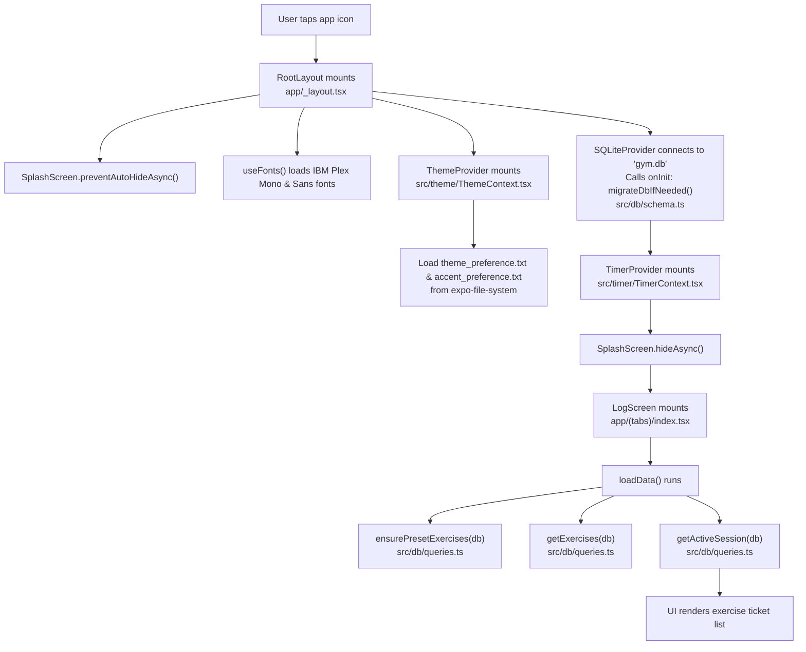
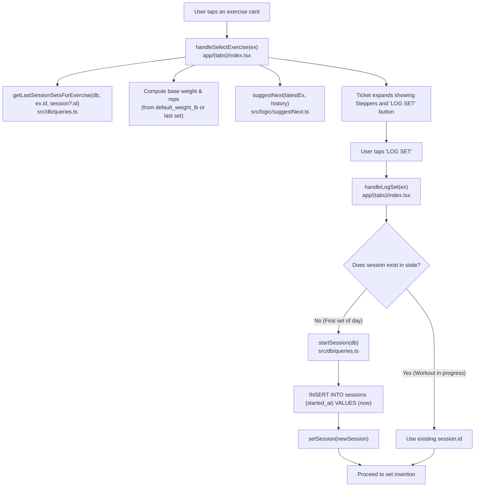
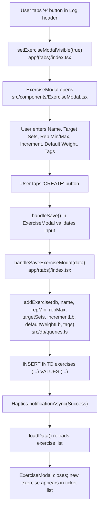
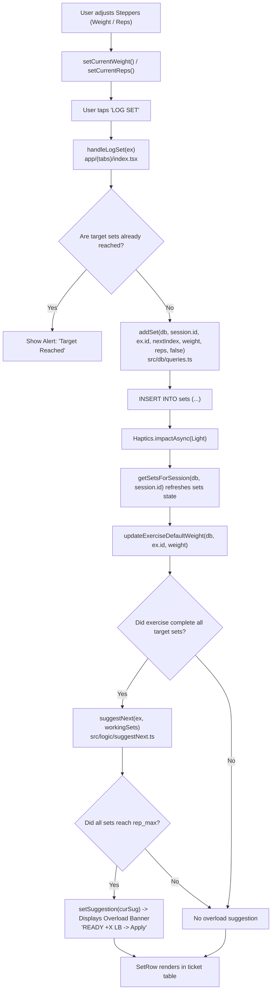
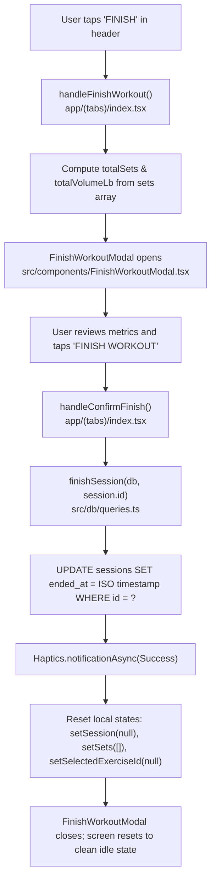
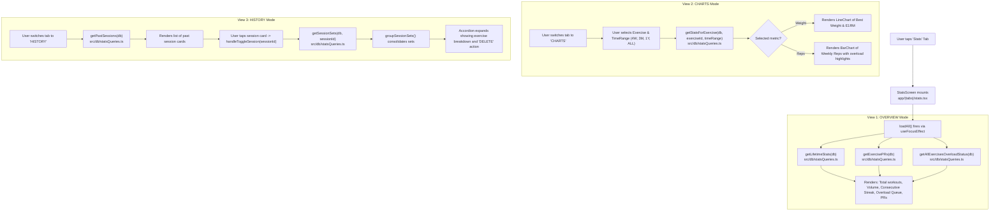

# 03 - User Flow Map

This document visually traces each major user journey through the Gym App, identifying the specific files, UI components, handlers, and database functions involved at every step.

---

## 1. Flow: Opening the App (Launch & Initialization)

- **Files Involved**:
  - [`app/_layout.tsx`](file:///home/leinnarf/Project/Gym%20App/app/_layout.tsx)
  - [`src/theme/ThemeContext.tsx`](file:///home/leinnarf/Project/Gym%20App/src/theme/ThemeContext.tsx)
  - [`src/db/schema.ts`](file:///home/leinnarf/Project/Gym%20App/src/db/schema.ts) (`migrateDbIfNeeded`)
  - [`src/timer/TimerContext.tsx`](file:///home/leinnarf/Project/Gym%20App/src/timer/TimerContext.tsx)
  - [`app/(tabs)/index.tsx`](file:///home/leinnarf/Project/Gym%20App/app/(tabs)/index.tsx) (`loadData`)
  - [`src/db/queries.ts`](file:///home/leinnarf/Project/Gym%20App/src/db/queries.ts) (`ensurePresetExercises`, `getExercises`, `getActiveSession`)

---

## 2. Flow: Starting a Workout (Creating a Session)

> [!NOTE]
> Sessions in this codebase are **lazily created**. A user does not have to press an explicit "Start Workout" button; tapping an exercise and logging the very first set automatically creates the session.

- **Files Involved**:
  - [`app/(tabs)/index.tsx`](file:///home/leinnarf/Project/Gym%20App/app/(tabs)/index.tsx) (`handleSelectExercise`, `handleLogSet`)
  - [`src/db/queries.ts`](file:///home/leinnarf/Project/Gym%20App/src/db/queries.ts) (`getLastSessionSetsForExercise`, `startSession`)
  - [`src/logic/suggestNext.ts`](file:///home/leinnarf/Project/Gym%20App/src/logic/suggestNext.ts) (`suggestNext`)

---

## 3. Flow: Adding a Custom Exercise

- **Files Involved**:
  - [`app/(tabs)/index.tsx`](file:///home/leinnarf/Project/Gym%20App/app/(tabs)/index.tsx) (`handleSaveExerciseModal`)
  - [`src/components/ExerciseModal.tsx`](file:///home/leinnarf/Project/Gym%20App/src/components/ExerciseModal.tsx)
  - [`src/db/queries.ts`](file:///home/leinnarf/Project/Gym%20App/src/db/queries.ts) (`addExercise`)

---

## 4. Flow: Logging a Set & Double Progression Overload

- **Files Involved**:
  - [`app/(tabs)/index.tsx`](file:///home/leinnarf/Project/Gym%20App/app/(tabs)/index.tsx) (`handleLogSet`, `handleAcceptSuggestion`)
  - [`src/components/ui/Stepper.tsx`](file:///home/leinnarf/Project/Gym%20App/src/components/ui/Stepper.tsx)
  - [`src/components/ui/Button.tsx`](file:///home/leinnarf/Project/Gym%20App/src/components/ui/Button.tsx)
  - [`src/components/ui/SetRow.tsx`](file:///home/leinnarf/Project/Gym%20App/src/components/ui/SetRow.tsx)
  - [`src/db/queries.ts`](file:///home/leinnarf/Project/Gym%20App/src/db/queries.ts) (`addSet`, `getSetsForSession`, `updateExerciseDefaultWeight`)
  - [`src/logic/suggestNext.ts`](file:///home/leinnarf/Project/Gym%20App/src/logic/suggestNext.ts) (`suggestNext`)

---

## 5. Flow: Editing an Exercise vs Deleting a Set

```mermaid
flowchart TD
    subgraph S1["Action: Deleting / Re-logging a Set"]
        A1["User taps Trash icon on SetRow"] --> A2["handleDeleteSet(setId)<br/>app/(tabs)/index.tsx"]
        A2 --> A3["deleteSet(db, setId)<br/>src/db/queries.ts"]
        A3 --> A4["DELETE FROM sets WHERE id = ?"]
        A4 --> A5["getSetsForSession(db, session.id)"]
        A5 --> A6{"Any sets left in session?"}
        A6 -- "No" --> A7["DELETE FROM sessions WHERE id = ?<br/>setSession(null)"]
        A6 -- "Yes" --> A8["setSets(updatedSets)"]
    end

    subgraph S2["Action: Editing Exercise Target Parameters"]
        B1["User long-presses Exercise Header"] --> B2["handleExerciseLongPress(ex)<br/>app/(tabs)/index.tsx"]
        B2 --> B3["ExerciseActionModal mounts<br/>src/components/ExerciseActionModal.tsx"]
        B3 --> B4["User taps 'EDIT EXERCISE'"]
        B4 --> B5["ExerciseModal opens prefilled<br/>src/components/ExerciseModal.tsx"]
        B5 --> B6["User modifies target sets, rep boundaries, increments, or tags"]
        B6 --> B7["updateExercise(db, id, ...)<br/>src/db/queries.ts"]
        B7 --> B8["loadData() updates tickets in view"]
    end
```

- **Files Involved**:
  - [`app/(tabs)/index.tsx`](file:///home/leinnarf/Project/Gym%20App/app/(tabs)/index.tsx) (`handleDeleteSet`, `handleExerciseLongPress`)
  - [`src/components/ExerciseActionModal.tsx`](file:///home/leinnarf/Project/Gym%20App/src/components/ExerciseActionModal.tsx)
  - [`src/components/ExerciseModal.tsx`](file:///home/leinnarf/Project/Gym%20App/src/components/ExerciseModal.tsx)
  - [`src/db/queries.ts`](file:///home/leinnarf/Project/Gym%20App/src/db/queries.ts) (`deleteSet`, `updateExercise`)

---

## 6. Flow: Completing a Workout Session

- **Files Involved**:
  - [`app/(tabs)/index.tsx`](file:///home/leinnarf/Project/Gym%20App/app/(tabs)/index.tsx) (`handleFinishWorkout`, `handleConfirmFinish`)
  - [`src/components/FinishWorkoutModal.tsx`](file:///home/leinnarf/Project/Gym%20App/src/components/FinishWorkoutModal.tsx)
  - [`src/db/queries.ts`](file:///home/leinnarf/Project/Gym%20App/src/db/queries.ts) (`finishSession`)

---

## 7. Flow: Viewing Progress, Charts & Past Sessions

- **Files Involved**:
  - [`app/(tabs)/stats.tsx`](file:///home/leinnarf/Project/Gym%20App/app/(tabs)/stats.tsx)
  - [`src/db/statsQueries.ts`](file:///home/leinnarf/Project/Gym%20App/src/db/statsQueries.ts) (`getLifetimeStats`, `getExercisePRs`, `getAllExercisesOverloadStatus`, `getStatsForExercise`, `getPastSessions`, `getSessionSets`)
  - [`src/logic/conversions.ts`](file:///home/leinnarf/Project/Gym%20App/src/logic/conversions.ts) (`calculateE1RM`)
