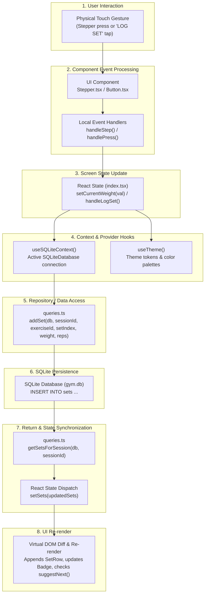
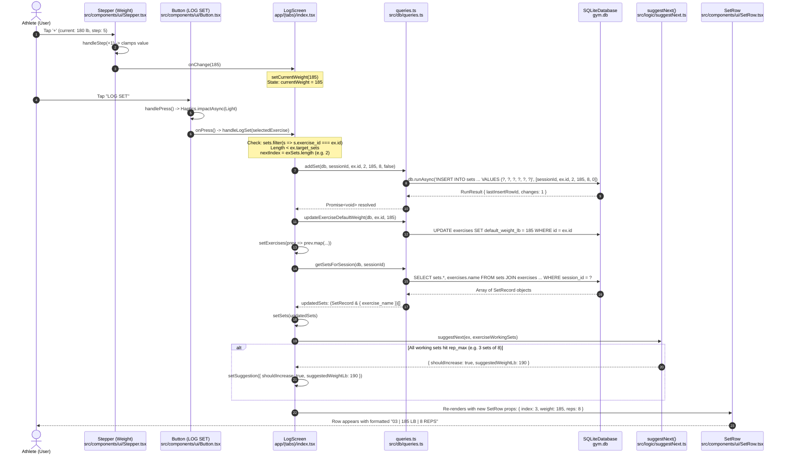

# 04 - Data Flow Map

This document tracks how data moves through the Gym App, showing the transformation of values from direct user interactions down through state, repositories, and SQLite persistence, and back up to UI re-renders.

---

## 1. End-to-End Data Pipeline Architecture



---

## 2. Sequence Diagram: Data Pipeline for Logging a Set



---

## 3. Data Transformations: Type by Type

### Step A: Raw Input to Numerical State
- **Source**: [`src/components/ui/Stepper.tsx`](file:///home/leinnarf/Project/Gym%20App/src/components/ui/Stepper.tsx#L59-L63)
- **Raw Input**: `value + direction * step` or string from `TextInput` (`"185"`).
- **Sanitized Value**: `parseFloat(cleanText)` clamped between `min: 0` and `max: undefined`.
- **Target State**: `currentWeight: number` (in [`app/(tabs)/index.tsx`](file:///home/leinnarf/Project/Gym%20App/app/(tabs)/index.tsx#L65)).

### Step B: Operational State to Database Schema Record
- **Source**: [`app/(tabs)/index.tsx`](file:///home/leinnarf/Project/Gym%20App/app/(tabs)/index.tsx#L197-L206)
- **Arguments to Repository**:
  ```ts
  addSet(
    db: SQLiteDatabase,
    sessionId: number,        // e.g. 4
    exerciseId: number,       // e.g. 2
    setIndex: number,         // e.g. 0, 1, 2
    weightLb: number,         // e.g. 185
    reps: number,             // e.g. 8
    isWarmup: boolean = false // 0
  )
  ```
- **SQL Execution**:
  ```sql
  INSERT INTO sets (session_id, exercise_id, set_index, weight_lb, reps, is_warmup)
  VALUES (?, ?, ?, ?, ?, ?);
  ```

### Step C: Database Record to UI ViewModel
- **Query Function**: [`getSetsForSession`](file:///home/leinnarf/Project/Gym%20App/src/db/queries.ts#L108)
- **Returned Data Type**:
  ```ts
  interface SetRecordWithExerciseName {
    id: number;
    session_id: number;
    exercise_id: number;
    set_index: number;
    weight_lb: number;
    reps: number;
    is_warmup: number;
    exercise_name: string;
  }
  ```
- **UI Props Mapping**:
  ```tsx
  <SetRow
    key={s.id}
    index={i + 1}          // Formats to 2 digits: "01", "02", "03"
    weight={s.weight_lb}   // Numeric display: 185
    reps={s.reps}          // Numeric display: 8
    onDelete={() => handleDeleteSet(s.id)}
  />
  ```

### Step D: Analytical Transformation (Stats Screen)
- **Raw Sets in DB**: Set records with timestamps from joined sessions.
- **Transformed Daily Aggregation** ([`src/db/statsQueries.ts`](file:///home/leinnarf/Project/Gym%20App/src/db/statsQueries.ts#L99-L131)):
  ```ts
  interface DailyStat {
    date: string;         // 'YYYY-MM-DD'
    volume: number;       // SUM(weight_lb * reps)
    bestE1rm: number;     // MAX(weight_lb * (1 + reps / 30))
    bestWeight: number;   // MAX(weight_lb)
    totalReps: number;    // SUM(reps)
    setReps: number[];    // [8, 8, 8]
  }
  ```
- **Transformed Weekly Aggregation**:
  ```ts
  interface WeeklyRepStat {
    weekStart: string;          // ISO Date for Monday of that week
    label: string;              // e.g. "Oct 5"
    totalReps: number;
    maxWeight: number;
    hasWeightIncrease: boolean; // Triggers highlight styling in bar charts
  }
  ```
