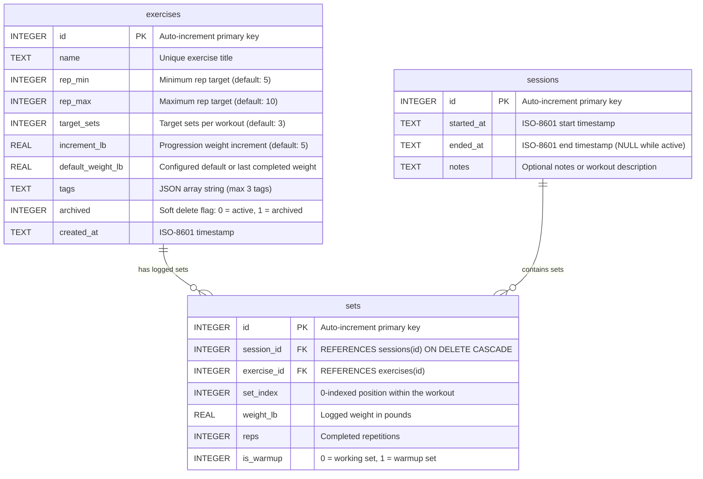

# 05 - Database Architecture & Schema Map

The Gym App persists all workout sessions, exercises, and sets locally using SQLite (`gym.db`) managed via `expo-sqlite`.

---

## 1. Entity Relationship (ER) Diagram



---

## 2. Table Definitions & Constraints

### 1. `exercises` Table
Stores definitions, targets, increments, and user tags for all available exercises.

```sql
CREATE TABLE exercises (
  id INTEGER PRIMARY KEY,
  name TEXT NOT NULL UNIQUE,
  rep_min INTEGER NOT NULL DEFAULT 5,
  rep_max INTEGER NOT NULL DEFAULT 10,
  target_sets INTEGER NOT NULL DEFAULT 3,
  increment_lb REAL NOT NULL DEFAULT 5,
  default_weight_lb REAL,
  tags TEXT,
  archived INTEGER NOT NULL DEFAULT 0,
  created_at TEXT NOT NULL
);
```

- **Primary Key**: `id`
- **Unique Constraint**: `name` must be unique.
- **Soft Deletion**: Deleting an exercise sets `archived = 1` rather than deleting rows, ensuring historical workout sessions retain full exercise metadata.
- **Tags Column**: Added in DB version 4, stores a JSON-stringified string array (e.g. `'["CHEST","COMPOUND"]'`).

### 2. `sessions` Table
Tracks individual workout sessions.

```sql
CREATE TABLE sessions (
  id INTEGER PRIMARY KEY,
  started_at TEXT NOT NULL,
  ended_at TEXT,
  notes TEXT
);
```

- **Active Session Identification**: An active (in-progress) session has `ended_at IS NULL`.
- **Finished Session Identification**: When finished, `ended_at` is updated with `new Date().toISOString()`.

### 3. `sets` Table
Stores granular set logs recorded during a workout session.

```sql
CREATE TABLE sets (
  id INTEGER PRIMARY KEY,
  session_id INTEGER NOT NULL REFERENCES sessions(id) ON DELETE CASCADE,
  exercise_id INTEGER NOT NULL REFERENCES exercises(id),
  set_index INTEGER NOT NULL,
  weight_lb REAL NOT NULL,
  reps INTEGER NOT NULL,
  is_warmup INTEGER NOT NULL DEFAULT 0
);

CREATE INDEX idx_sets_exercise ON sets(exercise_id, session_id);
```

- **Foreign Keys**:
  - `session_id` references `sessions(id)` with `ON DELETE CASCADE`. If a session is deleted from history, all associated sets are automatically purged.
  - `exercise_id` references `exercises(id)`.
- **Indexing**: `idx_sets_exercise ON sets(exercise_id, session_id)` accelerates analytics queries, PR searches, and historical queries by exercise.

---

## 3. Database Pragmas & Migrations

[`migrateDbIfNeeded`](file:///home/leinnarf/Project/Gym%20App/src/db/schema.ts#L3) runs whenever the SQLite connection is established:
1. **WAL Mode**: `PRAGMA journal_mode = 'wal'` enables Write-Ahead Logging for high-concurrency read/write operations.
2. **Foreign Keys**: `PRAGMA foreign_keys = ON` enforces referential integrity and cascading deletes.
3. **User Versioning**:
   - `Version 0 -> 1`: Initial tables creation (`exercises`, `sessions`, `sets`), `idx_sets_exercise` index, and seeding 7 default exercises (`Dips`, `Pull ups`, `Overhead Press`, `Barbell Row`, `Farmer's Carry`, `Bulgarian Split Squat`, `Romanian Deadlift`).
   - `Version 1 -> 2`: Re-seeding default exercises with `INSERT OR IGNORE`.
   - `Version 2 -> 3`: Added column `default_weight_lb REAL` to `exercises`.
   - `Version 3 -> 4`: Added column `tags TEXT` to `exercises`.

---

## 4. Application Read / Write Matrix

| Database Table | Read By (`SELECT`) | Written By (`INSERT` / `UPDATE` / `DELETE`) |
| :--- | :--- | :--- |
| **`exercises`** | - [`getExercises`](file:///home/leinnarf/Project/Gym%20App/src/db/queries.ts#L26): [index.tsx](file:///home/leinnarf/Project/Gym%20App/app/(tabs)/index.tsx#L78), [stats.tsx](file:///home/leinnarf/Project/Gym%20App/app/(tabs)/stats.tsx#L172)<br/>- [`getAllUniqueTags`](file:///home/leinnarf/Project/Gym%20App/src/db/queries.ts#L165)<br/>- [`SettingsScreen.handleExportJSON`](file:///home/leinnarf/Project/Gym%20App/app/(tabs)/settings.tsx#L33) | - [`addExercise`](file:///home/leinnarf/Project/Gym%20App/src/db/queries.ts#L34): [ExerciseModal.tsx](file:///home/leinnarf/Project/Gym%20App/src/components/ExerciseModal.tsx)<br/>- [`updateExercise`](file:///home/leinnarf/Project/Gym%20App/src/db/queries.ts#L58): [ExerciseModal.tsx](file:///home/leinnarf/Project/Gym%20App/src/components/ExerciseModal.tsx)<br/>- [`updateExerciseDefaultWeight`](file:///home/leinnarf/Project/Gym%20App/src/db/queries.ts#L93): [index.tsx](file:///home/leinnarf/Project/Gym%20App/app/(tabs)/index.tsx#L167)<br/>- [`deleteExercise`](file:///home/leinnarf/Project/Gym%20App/src/db/queries.ts#L104): [index.tsx](file:///home/leinnarf/Project/Gym%20App/app/(tabs)/index.tsx#L567) (soft delete: `archived = 1`)<br/>- [`ensurePresetExercises`](file:///home/leinnarf/Project/Gym%20App/src/db/queries.ts#L138): Seeds initial exercises |
| **`sessions`** | - [`getActiveSession`](file:///home/leinnarf/Project/Gym%20App/src/db/queries.ts#L4): [index.tsx](file:///home/leinnarf/Project/Gym%20App/app/(tabs)/index.tsx#L90)<br/>- [`getPastSessions`](file:///home/leinnarf/Project/Gym%20App/src/db/statsQueries.ts#L16): [stats.tsx](file:///home/leinnarf/Project/Gym%20App/app/(tabs)/stats.tsx#L163)<br/>- [`SettingsScreen.handleExportJSON`](file:///home/leinnarf/Project/Gym%20App/app/(tabs)/settings.tsx#L34) | - [`startSession`](file:///home/leinnarf/Project/Gym%20App/src/db/queries.ts#L10): [index.tsx](file:///home/leinnarf/Project/Gym%20App/app/(tabs)/index.tsx#L191)<br/>- [`finishSession`](file:///home/leinnarf/Project/Gym%20App/src/db/queries.ts#L19): [index.tsx](file:///home/leinnarf/Project/Gym%20App/app/(tabs)/index.tsx#L259)<br/>- Cleanup: [index.tsx](file:///home/leinnarf/Project/Gym%20App/app/(tabs)/index.tsx#L244) deletes session if all sets are deleted<br/>- Delete: [stats.tsx](file:///home/leinnarf/Project/Gym%20App/app/(tabs)/stats.tsx#L245) & [settings.tsx](file:///home/leinnarf/Project/Gym%20App/app/(tabs)/settings.tsx#L223) |
| **`sets`** | - [`getSetsForSession`](file:///home/leinnarf/Project/Gym%20App/src/db/queries.ts#L108): [index.tsx](file:///home/leinnarf/Project/Gym%20App/app/(tabs)/index.tsx#L93)<br/>- [`getLastSessionSetsForExercise`](file:///home/leinnarf/Project/Gym%20App/src/db/queries.ts#L185): [index.tsx](file:///home/leinnarf/Project/Gym%20App/app/(tabs)/index.tsx#L122)<br/>- [`getSessionSets`](file:///home/leinnarf/Project/Gym%20App/src/db/statsQueries.ts#L22): [stats.tsx](file:///home/leinnarf/Project/Gym%20App/app/(tabs)/stats.tsx#L223)<br/>- [`getStatsForExercise`](file:///home/leinnarf/Project/Gym%20App/src/db/statsQueries.ts#L59): [stats.tsx](file:///home/leinnarf/Project/Gym%20App/app/(tabs)/stats.tsx#L182)<br/>- [`getExercisePRs`](file:///home/leinnarf/Project/Gym%20App/src/db/statsQueries.ts#L180): [stats.tsx](file:///home/leinnarf/Project/Gym%20App/app/(tabs)/stats.tsx#L149)<br/>- [`getLifetimeStats`](file:///home/leinnarf/Project/Gym%20App/src/db/statsQueries.ts#L287): [stats.tsx](file:///home/leinnarf/Project/Gym%20App/app/(tabs)/stats.tsx#L146)<br/>- [`getAllExercisesOverloadStatus`](file:///home/leinnarf/Project/Gym%20App/src/db/statsQueries.ts#L355): [stats.tsx](file:///home/leinnarf/Project/Gym%20App/app/(tabs)/stats.tsx#L152)<br/>- [`SettingsScreen.handleExportCSV`](file:///home/leinnarf/Project/Gym%20App/app/(tabs)/settings.tsx#L75) | - [`addSet`](file:///home/leinnarf/Project/Gym%20App/src/db/queries.ts#L119): [index.tsx](file:///home/leinnarf/Project/Gym%20App/app/(tabs)/index.tsx#L197)<br/>- [`deleteSet`](file:///home/leinnarf/Project/Gym%20App/src/db/queries.ts#L134): [index.tsx](file:///home/leinnarf/Project/Gym%20App/app/(tabs)/index.tsx#L239)<br/>- Wipe logs: [stats.tsx](file:///home/leinnarf/Project/Gym%20App/app/(tabs)/stats.tsx#L244) & [settings.tsx](file:///home/leinnarf/Project/Gym%20App/app/(tabs)/settings.tsx#L222)<br/>- Full restore: [settings.tsx](file:///home/leinnarf/Project/Gym%20App/app/(tabs)/settings.tsx#L136) |
