# 06 - Module Dependency Map

This document maps the architectural dependencies between modules in the Gym App codebase, highlighting the strictly layered, unidirectional structure of the system.

---

## 1. High-Level Architectural Dependency Graph

```mermaid
graph TD
    subgraph Routes["1. Routes & Screens (app/)"]
        AppLayout["app/_layout.tsx"]
        TabLayout["app/(tabs)/_layout.tsx"]
        LogScreen["app/(tabs)/index.tsx"]
        StatsScreen["app/(tabs)/stats.tsx"]
        TimerScreen["app/(tabs)/timer.tsx"]
        ConvertScreen["app/(tabs)/convert.tsx"]
        SettingsScreen["app/(tabs)/settings.tsx"]
    end

    subgraph Modals["2. Domain Modals (src/components/)"]
        ExModal["ExerciseModal.tsx"]
        ActionModal["ExerciseActionModal.tsx"]
        FinishModal["FinishWorkoutModal.tsx"]
    end

    subgraph UIPrimitives["3. UI Primitives (src/components/ui/)"]
        ScreenComp["Screen.tsx"]
        ButtonComp["Button.tsx"]
        StepperComp["Stepper.tsx"]
        SetRowComp["SetRow.tsx"]
        BadgeComp["Badge.tsx"]
        FieldComp["Field.tsx"]
        RuleComp["Rule.tsx"]
        TextComp["Text.tsx"]
    end

    subgraph Contexts["4. Ambient Contexts & Themes"]
        ThemeContext["src/theme/ThemeContext.tsx"]
        TimerContext["src/timer/TimerContext.tsx"]
        Tokens["src/theme/tokens.ts"]
    end

    subgraph Logic["5. Pure Business Logic (src/logic/)"]
        SuggestNext["suggestNext.ts"]
        Conversions["conversions.ts"]
    end

    subgraph Repositories["6. Database & Repositories (src/db/)"]
        Schema["schema.ts"]
        Queries["queries.ts"]
        StatsQueries["statsQueries.ts"]
        DBTypes["types.ts"]
        SeedData["seedDemoData.ts"]
    end

    subgraph ExternalServices["7. Native & External Services"]
        ExpoSQLite["expo-sqlite"]
        ExpoHaptics["expo-haptics"]
        ExpoAudio["expo-audio"]
        ExpoFS["expo-file-system"]
        ExpoRouter["expo-router"]
        GiftedCharts["react-native-gifted-charts"]
    end

    %% Route Layer Dependencies
    AppLayout --> ThemeContext
    AppLayout --> TimerContext
    AppLayout --> Schema
    AppLayout --> ExpoSQLite
    AppLayout --> ExpoRouter

    TabLayout --> TextComp
    TabLayout --> ThemeContext
    TabLayout --> ExpoHaptics

    LogScreen --> ScreenComp
    LogScreen --> StepperComp
    LogScreen --> SetRowComp
    LogScreen --> ButtonComp
    LogScreen --> BadgeComp
    LogScreen --> ExModal
    LogScreen --> ActionModal
    LogScreen --> FinishModal
    LogScreen --> Queries
    LogScreen --> SuggestNext
    LogScreen --> ExpoSQLite
    LogScreen --> ExpoHaptics

    StatsScreen --> ScreenComp
    StatsScreen --> BadgeComp
    StatsScreen --> ButtonComp
    StatsScreen --> StatsQueries
    StatsScreen --> Queries
    StatsScreen --> GiftedCharts
    StatsScreen --> ExpoSQLite

    TimerScreen --> ScreenComp
    TimerScreen --> TimerContext
    TimerScreen --> ButtonComp
    TimerScreen --> TextComp

    ConvertScreen --> ScreenComp
    ConvertScreen --> Conversions
    ConvertScreen --> RuleComp

    SettingsScreen --> ScreenComp
    SettingsScreen --> ThemeContext
    SettingsScreen --> TimerContext
    SettingsScreen --> Queries
    SettingsScreen --> ExpoFS
    SettingsScreen --> ExpoSQLite

    %% Modals Dependencies
    ExModal --> FieldComp
    ExModal --> StepperComp
    ExModal --> ButtonComp
    ExModal --> RuleComp
    ActionModal --> ButtonComp
    ActionModal --> RuleComp
    FinishModal --> ButtonComp
    FinishModal --> RuleComp

    %% UI Primitives Dependencies
    ScreenComp --> ThemeContext
    ButtonComp --> ThemeContext
    StepperComp --> ThemeContext
    SetRowComp --> ThemeContext
    BadgeComp --> ThemeContext
    FieldComp --> ThemeContext
    RuleComp --> ThemeContext
    TextComp --> Tokens

    %% Context Dependencies
    ThemeContext --> Tokens
    ThemeContext --> ExpoFS
    TimerContext --> ExpoAudio
    TimerContext --> ExpoHaptics
    TimerContext --> ExpoFS

    %% Logic & DB Dependencies
    StatsQueries --> Queries
    StatsQueries --> SuggestNext
    StatsQueries --> Conversions
    StatsQueries --> DBTypes
    Queries --> DBTypes
    SuggestNext --> DBTypes
    Schema --> ExpoSQLite
    SeedData --> Queries
```

---

## 2. Dependency Invariants & Architectural Rules

1. **Unidirectional Dependency Flow**:
   - Routes import Components, Contexts, Logic, and Repositories.
   - Components import Primitives and Contexts.
   - Business logic (`src/logic/`) has **zero UI or database dependencies** (pure TypeScript functions depending only on data contracts in `src/db/types.ts`).
   - Repositories (`src/db/`) depend on `expo-sqlite` and `src/db/types.ts`, but never on React components or routing.

2. **Decoupled Business Logic**:
   - Progressive overload calculations in [`suggestNext.ts`](file:///home/leinnarf/Project/Gym%20App/src/logic/suggestNext.ts) can be tested completely in isolation without needing a database connection or React test renderer.

3. **Isolated Persistence**:
   - All SQL statements are restricted to [`src/db/queries.ts`](file:///home/leinnarf/Project/Gym%20App/src/db/queries.ts), [`src/db/statsQueries.ts`](file:///home/leinnarf/Project/Gym%20App/src/db/statsQueries.ts), and [`src/db/schema.ts`](file:///home/leinnarf/Project/Gym%20App/src/db/schema.ts). Screens interact with database entities via typed functions.
