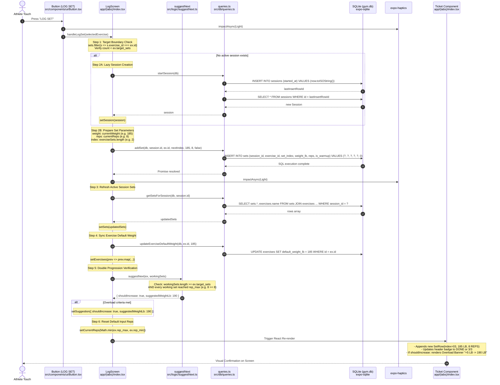

# 07 - Feature Deep Dive: Logging a Workout Set

This deep dive traces the exact execution lifecycle of **logging a workout set**, from the user's touch on the "LOG SET" button down through SQLite disk persistence, double-progression calculation, and back to UI updates.

---

## 1. Feature Lifecycle Sequence Diagram



---

## 2. Step-by-Step Execution Breakdown

### Step 1: User Touch & Tactile Feedback
- **File**: [`src/components/ui/Button.tsx`](file:///home/leinnarf/Project/Gym%20App/src/components/ui/Button.tsx#L37-L45)
- **Component / Function**: [`Button.handlePress()`](file:///home/leinnarf/Project/Gym%20App/src/components/ui/Button.tsx#L37)
- **Data In**: Physical press event on the primary button.
- **Data Out**: Triggers `onPress()` callback passed down from `LogScreen`.
- **Responsibility**: Provides immediate hardware tactile feedback using `Haptics.impactAsync(Haptics.ImpactFeedbackStyle.Light)` and invokes the screen-level handler without blocking the JS thread.

---

### Step 2: Boundary Validation & Lazy Session Initialization
- **File**: [`app/(tabs)/index.tsx`](file:///home/leinnarf/Project/Gym%20App/app/(tabs)/index.tsx#L177-L196)
- **Component / Function**: [`LogScreen.handleLogSet(ex: Exercise)`](file:///home/leinnarf/Project/Gym%20App/app/(tabs)/index.tsx#L177)
- **Data In**:
  - `ex`: Active [`Exercise`](file:///home/leinnarf/Project/Gym%20App/src/db/types.ts#L1) object (e.g. Romanian Deadlift, target_sets: 3).
  - `sets`: Current working set list in React state.
  - `session`: Current active session state (or `null`).
- **Data Out**:
  - Validates `exerciseSets.length < ex.target_sets`. If already at 3 sets, interrupts execution with an `Alert.alert('Target Reached')`.
  - If `session === null`, calls [`startSession(db)`](file:///home/leinnarf/Project/Gym%20App/src/db/queries.ts#L10) which inserts a new session row and updates state via `setSession(currentSession)`.
- **Responsibility**: Enforces workout boundaries and ensures that an active session row exists before inserting set records.

---

### Step 3: SQLite Set Record Persistence
- **File**: [`src/db/queries.ts`](file:///home/leinnarf/Project/Gym%20App/src/db/queries.ts#L119-L132)
- **Component / Function**: [`addSet()`](file:///home/leinnarf/Project/Gym%20App/src/db/queries.ts#L119)
- **Data In**:
  - `db`: Active `SQLiteDatabase` instance.
  - `sessionId`: `number` (e.g. `14`).
  - `exerciseId`: `number` (e.g. `7`).
  - `setIndex`: `number` (calculated as `exerciseSets.length`, e.g. `2` for the 3rd set).
  - `weightLb`: `number` (e.g. `205`).
  - `reps`: `number` (e.g. `8`).
  - `isWarmup`: `boolean` (`false`).
- **Data Out**: Resolves `Promise<void>`.
- **Responsibility**: Executes parameterized SQL insert:
  ```sql
  INSERT INTO sets (session_id, exercise_id, set_index, weight_lb, reps, is_warmup)
  VALUES (?, ?, ?, ?, ?, 0);
  ```
  Writes the record to disk with Write-Ahead Logging (`WAL`).

---

### Step 4: Synchronizing State & Updating Default Weight
- **File**: [`src/db/queries.ts`](file:///home/leinnarf/Project/Gym%20App/src/db/queries.ts#L93-L102) & [`app/(tabs)/index.tsx`](file:///home/leinnarf/Project/Gym%20App/app/(tabs)/index.tsx#L209-L218)
- **Component / Function**: [`updateExerciseDefaultWeight()`](file:///home/leinnarf/Project/Gym%20App/src/db/queries.ts#L93) and `getSetsForSession()`
- **Data In**: `exerciseId`, `currentWeight` (205 lb), and `session.id`.
- **Data Out**:
  - SQLite: `UPDATE exercises SET default_weight_lb = 205 WHERE id = 7;`
  - React State: `setExercises` updates the cached in-memory exercise definition.
  - React State: `setSets` receives the full refreshed list of `SetRecord` entries for the active session.
- **Responsibility**: Guarantees that the app remembers the most recent working weight for future sessions and synchronizes the UI state with the database.

---

### Step 5: Double Progression Overload Calculation
- **File**: [`src/logic/suggestNext.ts`](file:///home/leinnarf/Project/Gym%20App/src/logic/suggestNext.ts#L8-L42)
- **Component / Function**: [`suggestNext(exercise: Exercise, lastSessionSets: SetRecord[])`](file:///home/leinnarf/Project/Gym%20App/src/logic/suggestNext.ts#L8)
- **Data In**:
  - `exercise`: `rep_min: 6`, `rep_max: 8`, `target_sets: 3`, `increment_lb: 5`.
  - `lastSessionSets`: Filtered working sets for this exercise:
    `[{ reps: 8, weight_lb: 205 }, { reps: 8, weight_lb: 205 }, { reps: 8, weight_lb: 205 }]`.
- **Data Out**: Returns `ProgressionSuggestion`:
  ```ts
  {
    shouldIncrease: true,
    suggestedWeightLb: 210
  }
  ```
- **Responsibility**: Evaluates the Double Progression rule: if every target working set completed all `rep_max` reps, calculate the next load (`currentWeight + increment_lb`). If triggered, `setSuggestion(curSug)` renders the prompt banner.

---

### Step 6: UI Ticket Re-render
- **File**: [`app/(tabs)/index.tsx`](file:///home/leinnarf/Project/Gym%20App/app/(tabs)/index.tsx#L463-L540) & [`src/components/ui/SetRow.tsx`](file:///home/leinnarf/Project/Gym%20App/src/components/ui/SetRow.tsx#L18)
- **Component / Function**: `LogScreen` ticket view and `SetRow` component.
- **Data In**: Updated `sets` array and active `suggestion`.
- **Data Out**: Re-renders UI elements on screen:
  1. **New Set Row**: Displays `03 | 205 LB | 8 REPS | [Trash]`.
  2. **Exercise Badge**: Switches from `2/3` to `DONE` with overload styling.
  3. **Overload Banner**: Renders above steppers:
     `"READY +5 LB → 210 LB | TAP TO APPLY"`.
  4. **Rep Stepper**: Resets to base rep recommendation (`rep_min` or `rep_max`).
- **Responsibility**: Provides immediate visual feedback to the athlete so they know the set is logged and what weight to tackle next.
